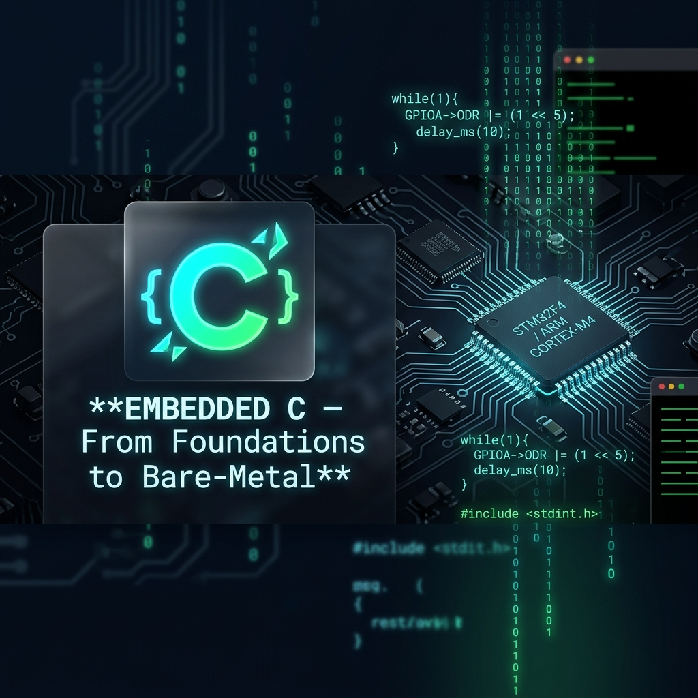

# Embedded C - From Foundations to Bare-Metal



Welcome to the **Embedded C Study Guide** - a comprehensive, hands-on reference for engineers working with microcontrollers, bare-metal systems, and performance-critical C code. Inspired by real-world embedded practice and MISRA-C guidelines.

## Table of Contents

1. [Module 01: Foundations & Compilation](#module-01)
    - [The GCC Compilation Pipeline](#module-01-pipeline)
    - [Your First Embedded Program](#module-01-first)
    - [Build Systems & Makefiles](#module-01-make)
    - [Understanding C Errors](#module-01-errors)
    - [Foundation Cementing: System Heartbeat](#module-01-foundation)
2. [Module 02: Variables, Types & Constants](#module-02)
    - [Primitive Types & Fixed-Width Integers](#module-02-types)
    - [`const`, `volatile`, and `#define`](#module-02-qualifiers)
    - [Storage Classes](#module-02-storage)
    - [Scope & Lifetime](#module-02-scope)
    - [Foundation Cementing: MCU Register Config](#module-02-foundation)
3. [Module 03: Operators & Control Flow](#module-03)
    - [Arithmetic & Relational Operators](#module-03-arith)
    - [Bitwise Operators - The Embedded Core](#module-03-bitwise)
    - [Control Flow: `if`, `switch`, Ternary](#module-03-flow)
    - [Foundation Cementing: GPIO State Machine](#module-03-foundation)
4. [Module 04: Functions & Scope](#module-04)
    - [Function Anatomy & Call Stack](#module-04-anatomy)
    - [`static`, `inline`, and `extern`](#module-04-keywords)
    - [Recursion & Stack Depth](#module-04-recursion)
    - [Function Pointers](#module-04-fnptr)
    - [Foundation Cementing: Dispatch Table](#module-04-foundation)
5. [Module 05: Arrays & Strings](#module-05)
    - [Arrays: Declaration & Iteration](#module-05-arrays)
    - [Multidimensional Arrays](#module-05-multi)
    - [Strings & `<string.h>`](#module-05-strings)
    - [Safe String Handling](#module-05-safe)
    - [Foundation Cementing: Sensor Data Buffer](#module-05-foundation)
6. [Module 06: Pointers & Memory](#module-06)
    - [Pointer Fundamentals](#module-06-basics)
    - [Pointer Arithmetic](#module-06-arith)
    - [`const` Pointers & Pointer-to-Pointer](#module-06-const)
    - [Function Pointers (Advanced)](#module-06-fnptr)
    - [Foundation Cementing: Register Map Access](#module-06-foundation)
7. [Module 07: Structs, Unions, Enums & Bit-Fields](#module-07)
    - [Structs & Typedef](#module-07-structs)
    - [Unions for Type Punning](#module-07-unions)
    - [Enums](#module-07-enums)
    - [Bit-Fields for Hardware Registers](#module-07-bitfields)
    - [Foundation Cementing: CAN Frame Model](#module-07-foundation)
8. [Module 08: Dynamic Memory Allocation](#module-08)
    - [`malloc`, `calloc`, `realloc`, `free`](#module-08-alloc)
    - [Common Memory Bugs](#module-08-bugs)
    - [Embedded Alternatives to Heap](#module-08-embedded)
    - [Foundation Cementing: Dynamic Buffer Pool](#module-08-foundation)
9. [Module 09: File I/O](#module-09)
    - [File Operations: `fopen`, `fclose`, `fread`, `fwrite`](#module-09-ops)
    - [Text vs Binary Files](#module-09-modes)
    - [Error Handling in I/O](#module-09-errors)
    - [Foundation Cementing: Data Logger](#module-09-foundation)
10. [Module 10: Preprocessor & Macros](#module-10)
    - [Include Guards & Conditional Compilation](#module-10-guards)
    - [Object-like & Function-like Macros](#module-10-macros)
    - [`_Static_assert` & Predefined Macros](#module-10-assert)
    - [X-Macros Pattern](#module-10-xmacro)
    - [Foundation Cementing: Safe Macro Toolkit](#module-10-foundation)
11. [Module 11: Bit Manipulation - The Embedded Core](#module-11)
    - [Setting, Clearing & Toggling Bits](#module-11-ops)
    - [Register Masking Patterns](#module-11-masks)
    - [Bit Shifting & Endianness](#module-11-shift)
    - [Foundation Cementing: GPIO Driver](#module-11-foundation)
12. [Module 12: Linked Lists & Data Structures](#module-12)
    - [Singly Linked List](#module-12-sll)
    - [Doubly Linked List](#module-12-dll)
    - [Circular Buffer (Ring Buffer)](#module-12-ring)
    - [Foundation Cementing: UART FIFO](#module-12-foundation)
13. [Module 13: Undefined Behavior & Safe Practices](#module-13)
    - [Common UB in C](#module-13-ub)
    - [Integer Overflow & Signed Arithmetic](#module-13-overflow)
    - [MISRA-C Guidelines](#module-13-misra)
    - [Foundation Cementing: Defensive Driver](#module-13-foundation)
14. [Module 14: Signal Handling & Variable Arguments](#module-14)
    - [Signal Handling with `signal()`](#module-14-signal)
    - [Variadic Functions with `<stdarg.h>`](#module-14-stdarg)
    - [Foundation Cementing: Fault Handler](#module-14-foundation)
15. [Module 15: Embedded C Patterns & Best Practices](#module-15)
    - [Finite State Machine (FSM)](#module-15-fsm)
    - [Callback & Event-Driven Architecture](#module-15-callbacks)
    - [Hardware Abstraction Layer (HAL) Design](#module-15-hal)
    - [RAII-in-C Patterns](#module-15-raii)
    - [Foundation Cementing: Sensor Pipeline](#module-15-foundation)
16. [Appendix A: Top Embedded C Interview Q&A](#appendix-a)
17. [Appendix B: Standard Library Quick Reference](#appendix-b)


<a name="module-01"></a>
## Module 01 - Foundations & Compilation
*Phase: Foundations*

C is a compiled, statically-typed, procedural language created by Dennis Ritchie in 1972 at Bell Labs. In embedded systems, it is the dominant language because it gives programmers direct control over memory and hardware while producing compact, efficient machine code.

> [!NOTE]
> **Design Philosophy**: Before writing a single line of C, you must understand how the compiler transforms text into instructions a CPU can execute. Embedded systems often have no operating system to save you - if your code crashes, the chip resets or hangs forever.

> **Who Uses This In The Real World?**
>
> * **STM32/NXP Firmware** - All register-level peripheral drivers are written in C.
> * **Linux Kernel** - Entirely written in C for portability across architectures.
> * **Arduino Core** - The underlying HAL is pure C.
> * **Automotive ECUs (Bosch, Continental)** - AUTOSAR layers are implemented in MISRA-C.

<a name="module-01-pipeline"></a>
### The GCC Compilation Pipeline

C code goes through four distinct stages before becoming executable firmware:

| Stage | Action | GCC Flag |
| :--- | :--- | :--- |
| **1. Preprocessor** | Expands `#include`, `#define`, `#ifdef`. Produces `.i` file. | `gcc -E main.c -o main.i` |
| **2. Compiler** | Translates C to assembly (`.s`). Applies optimizations. | `gcc -S main.c -o main.s` |
| **3. Assembler** | Converts assembly to object code (`.o` - binary, not yet linked). | `gcc -c main.c -o main.o` |
| **4. Linker** | Combines `.o` files, resolves symbols, produces final ELF/binary. | `gcc -o firmware main.o` |

> [!TIP]
> In embedded cross-compilation, you use `arm-none-eabi-gcc` instead of `gcc`. The pipeline is identical - only the target architecture changes.

<a name="module-01-first"></a>
### Your First Embedded Program

```c
#include <stdio.h>   /* Standard I/O for printf */
#include <stdint.h>  /* Fixed-width integers: uint8_t, uint32_t */

int main(void) {
    printf("[BOOT] System initializing...\n");
    printf("[BOOT] C runtime ready.\n");
    return 0;
}
```

#### Anatomy of the Program

* **`#include <stdio.h>`** - Preprocessor directive. Before compilation, the preprocessor copies the entire contents of `stdio.h` into your file. This gives you `printf`, `scanf`, `fopen`, etc.
* **`#include <stdint.h>`** - Brings in fixed-width integer types (`uint8_t`, `int32_t`, etc.). **Always include this in embedded code.** The size of `int` varies by platform; `int32_t` does not.
* **`int main(void)`** - The mandatory entry point. `void` explicitly states the function takes no parameters. In embedded, `main()` often never returns - it enters an infinite loop.
* **`return 0;`** - Signals success to the OS. On bare-metal, this is either omitted or replaced by `while(1) {}`.

**Compile and Run:**
```bash
gcc -std=c11 -Wall -Wextra -o firmware main.c
./firmware
```

**Bad Practice - Avoid**
```c
// Missing return type - implicit int is banned in C99+
main() { printf("Hello\n"); }

// Using int where size matters for hardware
int reg_value = 0xFF;  // Is int 16-bit or 32-bit? Platform-dependent!

// Implicit function declarations (banned in C99)
int x = atoi("42");    // Without #include <stdlib.h> - undefined behavior!
```

**Good Practice**
```c
#include <stdint.h>
#include <stdio.h>

/* Explicit types, explicit includes, explicit return */
int main(void) {
    uint8_t  status_reg = 0xA5U;  /* 'U' suffix = unsigned literal */
    uint32_t timestamp   = 0UL;
    printf("[MCU] Status: 0x%02X\n", status_reg);
    return 0;
}
```

> **Industry Best Practice**
>
> * Always compile with `-std=c11 -Wall -Wextra -Wconversion -Werror`. In safety-critical embedded (automotive, medical), `-Werror` promotes all warnings to errors.
> * In embedded: replace `printf` with a UART-based `debug_print()` wrapper. `printf` pulls in heavy float formatting code that bloats flash.
> * Use `__attribute__((noreturn))` on `main()` in bare-metal to tell the compiler it never returns, enabling better optimization.

<a name="module-01-make"></a>
### Build Systems & Makefiles

For projects with multiple `.c` files, a `Makefile` automates compilation.

```makefile
CC      = gcc
CFLAGS  = -std=c11 -Wall -Wextra -Wconversion -Werror
TARGET  = firmware
SRCS    = main.c sensor.c fsm.c
OBJS    = $(SRCS:.c=.o)

all: $(TARGET)

$(TARGET): $(OBJS)
	$(CC) $(CFLAGS) -o $@ $^

%.o: %.c
	$(CC) $(CFLAGS) -c $< -o $@

clean:
	rm -f $(OBJS) $(TARGET)
```

> [!NOTE]
> In embedded (STM32, NXP), the Makefile also specifies the linker script (`-T stm32.ld`), startup file, and target CPU (`-mcpu=cortex-m4 -mfpu=fpv4-sp-d16`).

<a name="module-01-errors"></a>
### Understanding C Errors

| Error Category | Example | Cause |
| :--- | :--- | :--- |
| **Syntax Error** | `error: expected ';'` | Missing semicolon, brace, or parenthesis |
| **Semantic Error** | `error: incompatible types` | Type mismatch in assignment or function call |
| **Linker Error** | `undefined reference to 'HAL_Init'` | Missing object file or library in link step |
| **Runtime Error** | Segmentation fault | NULL dereference, stack overflow, buffer overrun |

> [!WARNING]
> **The Golden Rule**: Always fix the **first** error and recompile. One missing `{` can generate 30 cascade errors. Do not attempt to fix error #15 before fixing error #1.

<a name="module-01-foundation"></a>
### Foundation Cementing: The System Heartbeat

A minimal "heartbeat" - the first thing any embedded system boots into:

```c
#include <stdio.h>
#include <stdint.h>

/* Firmware version constants */
#define FW_MAJOR 1U
#define FW_MINOR 0U
#define FW_PATCH 3U

int main(void) {
    printf("[BOOT] Firmware v%u.%u.%u starting...\n",
           FW_MAJOR, FW_MINOR, FW_PATCH);
    printf("[BOOT] CPU: ARM Cortex-M4 @ 168MHz\n");
    printf("[BOOT] Flash: 1MB | RAM: 192KB\n");
    printf("[OK]   System ready.\n");

    /* In bare-metal: never return. Enter the main control loop. */
    while (1) {
        /* Main application loop */
    }

    return 0; /* Never reached on real hardware */
}
```


<a name="module-02"></a>
## Module 02 - Variables, Types & Constants
*Phase: Foundations*

C's type system is simple but powerful. In embedded systems, **choosing the wrong type can corrupt hardware registers, cause silent overflow, or waste precious RAM**.

> [!NOTE]
> **Design Philosophy**: Embedded engineers don't use `int` casually. Every variable has an intentional width, sign, and lifetime. `uint8_t` on a register means something. `volatile uint32_t` on a memory-mapped address means something else entirely.

<a name="module-02-types"></a>
### Primitive Types & Fixed-Width Integers

**Never rely on `int` for hardware-level code.** Its size is platform-defined.

| Type (`<stdint.h>`) | Width | Range | Embedded Use Case |
| :--- | :---: | :--- | :--- |
| `uint8_t` | 8-bit | 0–255 | Register bytes, SPI/I2C data bytes |
| `int8_t` | 8-bit | -128–127 | Signed sensor offsets |
| `uint16_t` | 16-bit | 0–65535 | Timer period values, ADC raw counts |
| `int16_t` | 16-bit | -32768–32767 | Raw IMU acceleration |
| `uint32_t` | 32-bit | 0–4,294,967,295 | Timestamps (ms), peripheral base addresses |
| `int32_t` | 32-bit | ±2.1 billion | PID error accumulator |
| `uint64_t` | 64-bit | 0–18.4×10¹⁸ | High-resolution microsecond timestamps |
| `float` | 32-bit IEEE754 | ~6–7 sig. digits | Sensor fusion math |
| `double` | 64-bit IEEE754 | ~15 sig. digits | Navigation coordinates (use sparingly on MCU) |
| `size_t` | Platform | 0–SIZE_MAX | Array sizes, `sizeof` results, loop indices |

> [!IMPORTANT]
> Use `size_t` for array indices and sizes. Mixing `int` and `size_t` comparisons with `-Wconversion` enabled will produce compiler warnings that **hide real bugs**.

**Bad Practice - Avoid**
```c
int data = 0xFF;         /* What's the size? 16? 32? 64-bit? */
unsigned int timeout = 5000; /* Still platform-dependent width */
char buffer[256];        /* 'char' signedness is implementation-defined! */
```

**Good Practice**
```c
#include <stdint.h>
#include <stddef.h>  /* for size_t */

uint8_t  spi_byte     = 0xFFU;
uint32_t timeout_ms   = 5000UL;
int16_t  temperature  = -25;     /* Signed: can be negative */
size_t   buffer_index = 0U;
```

<a name="module-02-qualifiers"></a>
### `const`, `volatile`, and `#define`

These three are **the most misunderstood C keywords in embedded development**.

#### `const` - Read-only after initialization
```c
const uint32_t CLOCK_SPEED_HZ = 168000000UL; /* Cannot be modified */
```
`const` is enforced by the **compiler**. It means: *"I promise not to write to this."*

#### `volatile` - Do not optimize away reads/writes
```c
/* Memory-mapped GPIO Output Data Register */
volatile uint32_t * const GPIOA_ODR = (volatile uint32_t *)0x40020014U;
```
`volatile` tells the compiler: *"This value can change outside of program control (by hardware, ISR, or another thread). Do NOT cache it in a register - always read/write memory directly."*

> [!WARNING]
> **Every memory-mapped peripheral register MUST be `volatile`.** Without it, the compiler's optimizer will eliminate "redundant" reads/writes, breaking your driver silently. This is one of the most common bugs in embedded C.

#### `#define` - Preprocessor text substitution
```c
#define MAX_SENSORS    8U
#define TIMEOUT_MS     100U
#define LED_PIN        (1U << 5)   /* Always wrap in parentheses! */
```

> **`const` vs `#define` in Embedded:**
>
> | | `const` | `#define` |
> |---|---|---|
> | Type Safety | ✅ Yes | ❌ No |
> | Debugger visible | ✅ Yes | ❌ No |
> | Takes RAM? | ✅ Maybe (compiler decides) | ❌ No |
> | Use for | Typed constants, ROM tables | Integer tokens, bit masks |
>
> In modern C (C99+), prefer `const` for typed values. Use `#define` only for **bit-masks, pin definitions, and configuration tokens** where type doesn't matter.

<a name="module-02-storage"></a>
### Storage Classes

| Keyword | Where stored | Lifetime | Visibility |
| :--- | :--- | :--- | :--- |
| `auto` (default) | Stack | Until end of function | Local block |
| `static` (local) | `.bss`/`.data` (RAM) | Entire program | Local block only |
| `static` (global) | `.bss`/`.data` (RAM) | Entire program | **This file only** |
| `extern` | Defined elsewhere | Entire program | Other translation units |
| `register` | Hint for register | Auto lifetime | Local block |

> [!TIP]
> `static` on a local variable is a key embedded pattern. It retains its value between function calls - ideal for counters, state flags, and debounce timers:
> ```c
> void button_isr(void) {
>     static uint32_t press_count = 0U; /* Persists across ISR calls */
>     press_count++;
> }
> ```

<a name="module-02-scope"></a>
### Scope & Lifetime

```c
uint8_t global_var = 10U; /* Global: accessible everywhere in file */

void foo(void) {
    uint8_t local_var = 5U; /* Local: destroyed when foo() returns */
    {
        uint8_t block_var = 3U; /* Block scope: destroyed at } */
        /* Can access: global_var, local_var, block_var */
    }
    /* block_var no longer exists here */
}
```

> [!WARNING]
> In embedded, **avoid large local arrays**. They live on the stack. Stack overflow on an MCU is silent - it corrupts other variables or causes random resets. Use global or static arrays for buffers.

<a name="module-02-foundation"></a>
### Foundation Cementing: MCU Register Configuration

This demonstrates real-world type usage for configuring an STM32 GPIO peripheral:

```c
#include <stdint.h>

/* Memory-mapped register base addresses (from datasheet) */
#define RCC_BASE    0x40023800UL
#define GPIOA_BASE  0x40020000UL

/* Register offsets as volatile pointers */
volatile uint32_t * const RCC_AHB1ENR  = (volatile uint32_t *)(RCC_BASE  + 0x30U);
volatile uint32_t * const GPIOA_MODER  = (volatile uint32_t *)(GPIOA_BASE + 0x00U);
volatile uint32_t * const GPIOA_ODR    = (volatile uint32_t *)(GPIOA_BASE + 0x14U);

/* Bit-mask constants - use #define for hardware bit positions */
#define RCC_AHB1ENR_GPIOAEN   (1UL << 0)   /* Bit 0: GPIOA clock enable */
#define GPIOA_PIN5_OUTPUT     (1UL << 10)  /* MODER bits [11:10] = 01 for output */
#define GPIOA_PIN5_SET        (1UL << 5)   /* ODR bit 5 */

void led_init(void) {
    *RCC_AHB1ENR |= RCC_AHB1ENR_GPIOAEN;   /* Enable GPIOA clock */
    *GPIOA_MODER |= GPIOA_PIN5_OUTPUT;      /* Set PA5 as output */
}

void led_on(void)  { *GPIOA_ODR |=  GPIOA_PIN5_SET; }
void led_off(void) { *GPIOA_ODR &= ~GPIOA_PIN5_SET; }
```


<a name="module-03"></a>
## Module 03 - Operators & Control Flow
*Phase: Foundations*

> [!NOTE]
> **Design Philosophy**: In embedded C, the **bitwise operators** are not advanced topics - they are everyday tools. Every GPIO set, every register configuration, every protocol byte is built with `|`, `&`, `^`, and `~`.

<a name="module-03-arith"></a>
### Arithmetic & Relational Operators

| Operator | Example | Notes |
| :--- | :--- | :--- |
| `+`, `-`, `*`, `/` | `rpm = ticks / gear_ratio;` | Integer division truncates |
| `%` | `index = count % BUFFER_SIZE;` | Modulo - key for ring buffers |
| `==`, `!=`, `<`, `>`, `<=`, `>=` | `if (temp > 85)` | Returns 0 or 1 |
| `&&`, `\|\|`, `!` | `if (ready && !error)` | Logical - short-circuit evaluation |

**Bad Practice - Avoid**
```c
/* Floating point equality - NEVER do this */
float voltage = 3.3f;
if (voltage == 3.3f) { /* FALSE! Floating-point is inexact */ }

/* Integer division surprise */
int ratio = 5 / 2;  /* Result: 2, not 2.5 */
```

**Good Practice**
```c
#include <math.h>   /* fabsf */

float voltage = measure_adc();
if (fabsf(voltage - 3.3f) < 0.01f) { /* Compare within epsilon */ }

/* Explicit cast before division when decimal result needed */
float ratio = (float)raw_counts / (float)full_scale;
```

<a name="module-03-bitwise"></a>
### Bitwise Operators - The Embedded Core

| Operator | Name | Example | Result |
| :--- | :--- | :--- | :--- |
| `&` | AND | `0xF0 & 0x3C` | `0x30` - mask/clear bits |
| `\|` | OR | `0xF0 \| 0x0F` | `0xFF` - set bits |
| `^` | XOR | `0xFF ^ 0x0F` | `0xF0` - toggle bits |
| `~` | NOT | `~0x0F` | `0xFFFFFFF0` - invert all bits |
| `<<` | Left shift | `1U << 5` | `0x20` - multiply by 2^5 |
| `>>` | Right shift | `0x40 >> 2` | `0x10` - divide by 4 |

**The Three Essential Patterns:**
```c
#define PIN5   (1U << 5)   /* Bit mask for pin 5 */

/* Set bit 5 */
GPIOA->ODR |= PIN5;

/* Clear bit 5 */
GPIOA->ODR &= ~PIN5;

/* Toggle bit 5 */
GPIOA->ODR ^= PIN5;

/* Read/test bit 5 */
if (GPIOA->IDR & PIN5) {
    /* Pin is HIGH */
}
```

> [!IMPORTANT]
> Always use `U` suffix (`1U << n`) for bit-shift operations. Left-shifting a signed `1` into the sign bit is **undefined behavior** in C.

<a name="module-03-flow"></a>
### Control Flow: `if`, `switch`, Ternary

```c
/* if / else if / else */
if (battery_pct > 80U) {
    set_led(GREEN);
} else if (battery_pct > 20U) {
    set_led(YELLOW);
} else {
    set_led(RED);
    trigger_low_battery_alarm();
}

/* switch - preferred for FSM state dispatch */
switch (system_state) {
    case STATE_IDLE:
        handle_idle();
        break;
    case STATE_ACTIVE:
        handle_active();
        break;
    case STATE_FAULT:
        handle_fault();
        break;
    default:
        /* Must always have a default in MISRA-C */
        handle_unknown();
        break;
}

/* Ternary - use sparingly, only for simple conditional assignments */
uint8_t out = (temp > 85U) ? 0xFFU : 0x00U;
```

> [!TIP]
> In MISRA-C Rule 15.7: Every `if-else if` chain **must** terminate with a final `else`. Every `switch` **must** have a `default`. This ensures all code paths are explicitly handled - critical for safety systems.

**Loops**
```c
/* for loop - preferred when iteration count is known */
for (uint8_t i = 0U; i < NUM_SENSORS; i++) {
    read_sensor(i);
}

/* while loop - preferred for event-driven polling */
while (!uart_rx_ready()) {
    /* Wait for byte */
}

/* do-while - executes at least once */
do {
    status = spi_transfer(cmd);
} while (status == SPI_BUSY);
```

<a name="module-03-foundation"></a>
### Foundation Cementing: GPIO State Machine

```c
#include <stdint.h>
#include <stdbool.h>

typedef enum {
    GPIO_LOW  = 0U,
    GPIO_HIGH = 1U
} gpio_state_t;

#define DEBOUNCE_COUNT 3U

gpio_state_t debounce_pin(void) {
    static uint8_t count = 0U;
    bool raw = read_pin();        /* Platform-specific */

    if (raw) {
        count = (count < 0xFFU) ? count + 1U : 0xFFU; /* Clamp, no overflow */
    } else {
        count = 0U;
    }
    return (count >= DEBOUNCE_COUNT) ? GPIO_HIGH : GPIO_LOW;
}
```


<a name="module-04"></a>
## Module 04 - Functions & Scope
*Phase: Foundations*

> [!NOTE]
> **Design Philosophy**: In embedded C, functions are not just for code reuse - they define the **call stack depth**. On an MCU with 4KB of RAM, every nested function call consumes stack space. Understanding this is the difference between a stable firmware and one that crashes at 3AM in production.

<a name="module-04-anatomy"></a>
### Function Anatomy & Call Stack

```c
/* Declaration (prototype) - goes in header file */
int32_t calculate_pid(int32_t setpoint, int32_t measured);

/* Definition - goes in source file */
int32_t calculate_pid(int32_t setpoint, int32_t measured) {
    static float integral = 0.0f;  /* Persistent accumulator */
    const float KP = 0.5f;
    const float KI = 0.01f;

    int32_t error = setpoint - measured;
    integral += (float)error * KI;

    return (int32_t)(KP * (float)error + integral);
}
```

**The Call Stack:** Each function call creates a **stack frame** containing:
- Return address
- Local variables
- Saved registers

> [!WARNING]
> STM32F4 default stack: 1KB. If you allocate `uint8_t buf[512]` inside 3 nested functions, you overflow. **Profile your maximum stack depth** during development with watermark patterns.

<a name="module-04-keywords"></a>
### `static`, `inline`, and `extern`

```c
/* static function - visible only within this .c file */
/* Use for internal "private" helper functions */
static uint16_t crc16_compute(const uint8_t *buf, size_t len) {
    uint16_t crc = 0xFFFFU;
    for (size_t i = 0U; i < len; i++) {
        crc ^= (uint16_t)buf[i];
    }
    return crc;
}

/* inline - compiler hint to expand function in-place (avoids call overhead) */
/* Ideal for tiny, frequently-called functions */
static inline uint32_t clamp_u32(uint32_t val, uint32_t lo, uint32_t hi) {
    if (val < lo) return lo;
    if (val > hi) return hi;
    return val;
}

/* extern - declare a variable defined in another .c file */
extern uint32_t g_system_tick; /* Defined in main.c, used here */
```

> [!TIP]
> Mark all internal-use functions as `static`. This prevents **symbol pollution** across translation units and allows the linker to eliminate dead code (`--gc-sections`).

<a name="module-04-recursion"></a>
### Recursion & Stack Depth

```c
/* Recursive factorial - educational only, avoid in embedded */
uint32_t factorial(uint32_t n) {
    if (n == 0U) return 1U;
    return n * factorial(n - 1U); /* Each call adds a stack frame! */
}

/* Iterative version - always prefer in embedded */
uint32_t factorial_iter(uint32_t n) {
    uint32_t result = 1U;
    for (uint32_t i = 2U; i <= n; i++) {
        result *= i;
    }
    return result;
}
```

> [!WARNING]
> MISRA-C Rule 17.2 bans **recursion** entirely in safety-critical code. Maximum stack depth must be statically analyzable. If you can't prove it, don't use it.

<a name="module-04-fnptr"></a>
### Function Pointers

A function pointer stores the address of a function, enabling callbacks and dispatch tables.

```c
/* Declare a type for a function that takes uint8_t and returns void */
typedef void (*event_handler_t)(uint8_t event_id);

/* Actual handler functions */
void on_button_press(uint8_t id) { /* ... */ }
void on_timeout(uint8_t id)      { /* ... */ }

/* Store and call via pointer */
event_handler_t handler = on_button_press;
handler(1U); /* Calls on_button_press(1) */

/* Array of function pointers - the dispatch table */
event_handler_t handlers[2] = { on_button_press, on_timeout };
handlers[0](0U); /* Calls on_button_press */
handlers[1](1U); /* Calls on_timeout */
```

<a name="module-04-foundation"></a>
### Foundation Cementing: Dispatch Table

A dispatch table replaces large `switch` statements with O(1) function lookups:

```c
#include <stdint.h>

typedef enum {
    CMD_START   = 0U,
    CMD_STOP    = 1U,
    CMD_STATUS  = 2U,
    CMD_COUNT   /* Sentinel: always last */
} command_t;

typedef void (*cmd_handler_t)(void);

static void handle_start(void)  { /* Start motors */ }
static void handle_stop(void)   { /* Stop motors  */ }
static void handle_status(void) { /* Report state */ }

/* Dispatch table - indexed by command ID */
static const cmd_handler_t dispatch[CMD_COUNT] = {
    [CMD_START]  = handle_start,
    [CMD_STOP]   = handle_stop,
    [CMD_STATUS] = handle_status,
};

void process_command(command_t cmd) {
    if (cmd < CMD_COUNT && dispatch[cmd] != NULL) {
        dispatch[cmd]();
    }
}
```


<a name="module-05"></a>
## Module 05 - Arrays & Strings
*Phase: Data Handling*

> [!NOTE]
> **Design Philosophy**: In C, arrays and strings are not high-level objects with built-in safety - they are raw memory regions. Buffer overflows are **the #1 source of vulnerabilities in C code**. Embedded firmware with buffer bugs can corrupt critical variables or overwrite return addresses.

<a name="module-05-arrays"></a>
### Arrays: Declaration & Iteration

```c
#include <stdint.h>
#include <stddef.h>

/* Declaration and initialization */
uint16_t adc_samples[8] = {0U};          /* Zero-initialized */
uint8_t  uart_buf[64]   = {0xAAU, 0xBBU}; /* Partial init: rest are 0 */

/* Preferred iteration: use a constant for size */
#define NUM_SAMPLES 8U
uint16_t samples[NUM_SAMPLES];

for (size_t i = 0U; i < NUM_SAMPLES; i++) {
    samples[i] = read_adc(i);
}

/* Get array length with sizeof */
size_t len = sizeof(samples) / sizeof(samples[0]);
```

**Bad Practice - Avoid**
```c
uint8_t buf[10];
buf[10] = 0xFF; /* OUT OF BOUNDS - undefined behavior, may corrupt stack */

/* 'Magic number' array size */
for (int i = 0; i < 10; i++) { /* What if the array changes to 12? */ }
```

**Good Practice**
```c
#define BUF_SIZE 10U
uint8_t buf[BUF_SIZE] = {0U};

for (size_t i = 0U; i < BUF_SIZE; i++) {
    buf[i] = 0xFFU;
}
```

<a name="module-05-multi"></a>
### Multidimensional Arrays

```c
/* 3 sensors, each with X/Y/Z readings */
#define NUM_SENSORS 3U
#define NUM_AXES    3U

float imu_data[NUM_SENSORS][NUM_AXES] = {{0.0f}};

/* Access: imu_data[sensor][axis] */
imu_data[0][0] = read_accel_x();

/* Row-major iteration - most cache-friendly */
for (size_t s = 0U; s < NUM_SENSORS; s++) {
    for (size_t a = 0U; a < NUM_AXES; a++) {
        process(imu_data[s][a]);
    }
}
```

> [!TIP]
> C arrays are stored in **row-major order**. Always iterate the rightmost index in the inner loop for best cache performance. On MCUs with data caches (Cortex-M7), this matters significantly.

<a name="module-05-strings"></a>
### Strings & `<string.h>`

In C, a string is a `char` array terminated by a null byte (`'\0'`).

```c
char name[] = "SENSOR_01";    /* Compiler auto-adds '\0' at end */
char buf[16] = {0};           /* Manual zero-init */

/* Key <string.h> functions */
size_t len  = strlen(name);          /* Length, not counting '\0' */
strcmp("A", "B");                    /* 0 if equal, <0 or >0 otherwise */
strncmp(a, b, sizeof(a) - 1U);      /* Bounded compare */
memcpy(buf, src, sizeof(buf));       /* Copy raw bytes */
memset(buf, 0, sizeof(buf));         /* Zero fill */
```

> [!WARNING]
> **`strcpy` and `strcat` are dangerous** - they do not check buffer size. They are banned in MISRA-C and most secure coding standards. Always use the bounded variants.

<a name="module-05-safe"></a>
### Safe String Handling

| Dangerous | Safe Alternative |
| :--- | :--- |
| `strcpy(dst, src)` | `strncpy(dst, src, sizeof(dst) - 1U); dst[sizeof(dst)-1] = '\0';` |
| `strcat(dst, src)` | `strncat(dst, src, sizeof(dst) - strlen(dst) - 1U)` |
| `gets(buf)` | **Banned entirely.** Use `fgets(buf, sizeof(buf), stdin)` |
| `sprintf(buf, ...)` | `snprintf(buf, sizeof(buf), ...)` |
| `atoi(str)` | `strtol(str, &end, 10)` and check `errno` |

```c
#include <stdio.h>
#include <string.h>

char device_name[32] = {0};
const char *src = "STM32F4_SENSOR_NODE_UNIT_7_EXTENDED";

/* Safe: snprintf always null-terminates */
snprintf(device_name, sizeof(device_name), "%s", src);

printf("Device: %s\n", device_name); /* Output: "STM32F4_SENSOR_NODE_UNI" (truncated safely) */
```

<a name="module-05-foundation"></a>
### Foundation Cementing: Sensor Data Buffer

```c
#include <stdint.h>
#include <string.h>
#include <stdio.h>

#define MAX_SENSOR_NAME  16U
#define HISTORY_LEN      8U

typedef struct {
    char     name[MAX_SENSOR_NAME];
    float    readings[HISTORY_LEN];
    uint8_t  head;   /* Points to next write position */
    uint8_t  count;  /* Number of valid readings */
} sensor_buffer_t;

void sensor_push(sensor_buffer_t *s, float value) {
    s->readings[s->head] = value;
    s->head = (uint8_t)((s->head + 1U) % HISTORY_LEN); /* Wrap around */
    if (s->count < HISTORY_LEN) {
        s->count++;
    }
}

float sensor_average(const sensor_buffer_t *s) {
    if (s->count == 0U) return 0.0f;
    float sum = 0.0f;
    for (uint8_t i = 0U; i < s->count; i++) {
        sum += s->readings[i];
    }
    return sum / (float)s->count;
}

int main(void) {
    sensor_buffer_t temp_sensor = {0};
    snprintf(temp_sensor.name, sizeof(temp_sensor.name), "TEMP_0");

    float samples[] = {23.1f, 23.4f, 24.0f, 23.8f};
    for (size_t i = 0U; i < 4U; i++) {
        sensor_push(&temp_sensor, samples[i]);
    }
    printf("[%s] Avg: %.2f C\n", temp_sensor.name, sensor_average(&temp_sensor));
    return 0;
}
```


<a name="module-06"></a>
## Module 06 - Pointers & Memory
*Phase: Core C*

> [!NOTE]
> **Design Philosophy**: Pointers are C's most powerful - and most dangerous - feature. In embedded, pointers are how you write hardware registers, implement callbacks, pass large structs efficiently, and build dynamic data structures. Mastering pointers is non-negotiable for embedded engineers.

<a name="module-06-basics"></a>
### Pointer Fundamentals

```c
#include <stdint.h>

uint32_t voltage_mv = 3300U;
uint32_t *p_voltage = &voltage_mv; /* p_voltage holds the address of voltage_mv */

/* Dereferencing: read the value at the address */
printf("Voltage: %u mV\n", *p_voltage);  /* 3300 */

/* Modify via pointer */
*p_voltage = 5000U;
printf("Voltage: %u mV\n", voltage_mv); /* 5000 */

/* NULL pointer - always initialize unused pointers to NULL */
uint8_t *p_data = NULL;
if (p_data != NULL) { /* Always guard before dereferencing */
    *p_data = 0xFF;
}
```

**Size of a pointer is always the address bus width:**
| Architecture | Pointer size |
| :--- | :--- |
| 8-bit AVR | 2 bytes (16-bit address) |
| 32-bit ARM Cortex-M | 4 bytes |
| 64-bit x86 / ARM64 | 8 bytes |

<a name="module-06-arith"></a>
### Pointer Arithmetic

```c
uint8_t buf[4] = {0xAA, 0xBB, 0xCC, 0xDD};
uint8_t *p = buf;   /* Points to buf[0] */

printf("0x%02X\n", *p);         /* 0xAA */
p++;                             /* Advance by sizeof(uint8_t) = 1 byte */
printf("0x%02X\n", *p);         /* 0xBB */
printf("0x%02X\n", *(p + 2));   /* 0xDD - does not move p */

/* Pointer difference */
uint8_t *start = buf;
uint8_t *end   = buf + 4;
ptrdiff_t span = end - start;  /* 4 - use ptrdiff_t for differences */
```

> [!WARNING]
> Pointer arithmetic **beyond array bounds** is undefined behavior. `p + 5` on a 4-element array looks innocent but can read random memory or cause security vulnerabilities.

<a name="module-06-const"></a>
### `const` Pointers & Pointer-to-Pointer

```c
uint32_t val = 42U;

/* Pointer to const - cannot modify value through pointer */
const uint32_t *p_ro = &val;
/* *p_ro = 99U; */ /* ERROR: read-only */

/* Const pointer - pointer cannot be redirected */
uint32_t * const p_fixed = &val;
*p_fixed = 99U;   /* OK - can modify value */
/* p_fixed = ...; */ /* ERROR: pointer is const */

/* Const pointer to const - fully read-only */
const uint32_t * const p_full_ro = &val;

/* Pointer to pointer - used for output parameters */
void get_buffer(uint8_t **pp_buf) {
    static uint8_t internal_buf[64];
    *pp_buf = internal_buf; /* Write the address into caller's pointer */
}
```

> [!TIP]
> **Rule**: When passing a pointer to a function that should NOT modify the data, always use `const T *`. This documents intent and enables compiler error catching if a function accidentally writes.

<a name="module-06-fnptr"></a>
### Function Pointers (Advanced)

```c
/* Interrupt Service Routines are often registered via function pointers */
typedef void (*isr_handler_t)(void);

static isr_handler_t isr_table[16] = {NULL}; /* 16 interrupt slots */

void register_isr(uint8_t irq_num, isr_handler_t handler) {
    if (irq_num < 16U && handler != NULL) {
        isr_table[irq_num] = handler;
    }
}

void dispatch_isr(uint8_t irq_num) {
    if (irq_num < 16U && isr_table[irq_num] != NULL) {
        isr_table[irq_num](); /* Call the registered handler */
    }
}
```

<a name="module-06-foundation"></a>
### Foundation Cementing: Register Map Access

Accessing hardware registers via typed pointer structures (CMSIS style):

```c
#include <stdint.h>

/* Define GPIO peripheral as a struct */
typedef struct {
    volatile uint32_t MODER;   /* Mode register */
    volatile uint32_t OTYPER;  /* Output type register */
    volatile uint32_t OSPEEDR; /* Speed register */
    volatile uint32_t PUPDR;   /* Pull-up/pull-down register */
    volatile uint32_t IDR;     /* Input data register */
    volatile uint32_t ODR;     /* Output data register */
    volatile uint32_t BSRR;    /* Bit set/reset register */
} GPIO_t;

/* Cast the base address to a pointer to our struct */
#define GPIOA  ((GPIO_t *)0x40020000UL)
#define GPIOB  ((GPIO_t *)0x40020400UL)

/* Access registers by name - clean, readable, type-safe */
void gpio_init_output(GPIO_t *port, uint32_t pin) {
    /* Clear mode bits, then set to output (01) */
    port->MODER &= ~(0x3UL << (pin * 2U));
    port->MODER |=  (0x1UL << (pin * 2U));
}

void gpio_set(GPIO_t *port, uint32_t pin) {
    port->BSRR = (1UL << pin); /* Atomic set via BSRR */
}

void gpio_reset(GPIO_t *port, uint32_t pin) {
    port->BSRR = (1UL << (pin + 16U)); /* Atomic reset via BSRR high word */
}
```


<a name="module-07"></a>
## Module 07 - Structs, Unions, Enums & Bit-Fields
*Phase: Data Modeling*

> [!NOTE]
> **Design Philosophy**: Structs are the foundation of **hardware abstraction** in C. A peripheral register block is a struct. A sensor reading is a struct. A CAN frame is a struct. Knowing how to model data precisely - including bit-level layout with bit-fields - separates a firmware engineer from a programmer.

<a name="module-07-structs"></a>
### Structs & Typedef

```c
#include <stdint.h>

/* Without typedef - must always write 'struct SensorData' */
struct SensorData {
    uint16_t raw_adc;
    float    temperature;
    uint8_t  sensor_id;
};

/* With typedef - write just 'sensor_data_t' */
typedef struct {
    uint16_t raw_adc;
    float    temperature;
    uint8_t  sensor_id;
    uint8_t  _pad[1]; /* Explicit padding to control alignment */
} sensor_data_t;

/* Initialize */
sensor_data_t reading = {
    .raw_adc     = 2048U,
    .temperature = 23.5f,
    .sensor_id   = 3U,
};

/* Pass by pointer - avoids copying struct on every function call */
void process_sensor(const sensor_data_t *data) {
    printf("Sensor %u: %.2f C\n", data->sensor_id, data->temperature);
}
```

> [!TIP]
> Use **designated initializers** (`.field = value`) to initialize structs - they are order-independent, self-documenting, and zero-initialize any unspecified fields.

**Struct Memory Layout:**
```
sensor_data_t (size = 8 bytes on 32-bit ARM)
+----------+----------+----------+----------+
| raw_adc  | raw_adc  | temp     | temp     |
| (byte 0) | (byte 1) | (byte 2) | (byte 3) |
+----------+----------+----------+----------+
| temp     | temp     | id       | _pad     |
| (byte 4) | (byte 5) | (byte 6) | (byte 7) |
+----------+----------+----------+----------+
```

<a name="module-07-unions"></a>
### Unions for Type Punning

A union overlaps all its members at the same memory address. The size equals the largest member.

```c
/* Common embedded pattern: access bytes of a 32-bit word individually */
typedef union {
    uint32_t word;         /* 32-bit view */
    uint8_t  bytes[4];     /* Byte-by-byte view */
} u32_bytes_t;

u32_bytes_t data;
data.word = 0xDEADBEEFUL;

printf("Byte 0: 0x%02X\n", data.bytes[0]); /* 0xEF (little-endian) */
printf("Byte 1: 0x%02X\n", data.bytes[1]); /* 0xBE */
```

> [!WARNING]
> Formally, reading a union member other than the last-written member is **implementation-defined** in C. Most embedded compilers (GCC arm-none-eabi) define and document this behavior and it is widely used. Document when you rely on it.

<a name="module-07-enums"></a>
### Enums

```c
/* Named constants replacing magic numbers */
typedef enum {
    SENSOR_OK    = 0U,
    SENSOR_TIMEOUT = 1U,
    SENSOR_ERROR   = 2U,
    SENSOR_OFFLINE = 3U
} sensor_status_t;

sensor_status_t read_sensor(uint8_t id) {
    if (id > MAX_SENSOR_ID) return SENSOR_ERROR;
    /* ... */
    return SENSOR_OK;
}

/* Enums used as bitmask flags */
typedef enum {
    FLAG_NONE    = 0x00U,
    FLAG_READY   = 0x01U,
    FLAG_BUSY    = 0x02U,
    FLAG_ERROR   = 0x04U,
    FLAG_TIMEOUT = 0x08U
} system_flags_t;

uint8_t flags = FLAG_READY | FLAG_BUSY;
```

<a name="module-07-bitfields"></a>
### Bit-Fields for Hardware Registers

```c
/* Model an I2C Status Register bit by bit */
typedef struct {
    uint8_t busy     : 1;  /* Bit 0 */
    uint8_t read_nwr : 1;  /* Bit 1 */
    uint8_t al       : 1;  /* Bit 2: Arbitration Lost */
    uint8_t reserved : 1;  /* Bit 3 */
    uint8_t rxak     : 1;  /* Bit 4: Received ACK */
    uint8_t iicif    : 1;  /* Bit 5: Interrupt Flag */
    uint8_t srw      : 1;  /* Bit 6: Slave R/W */
    uint8_t rxrdy    : 1;  /* Bit 7: Receive Data Ready */
} i2c_status_reg_t;

/* Note: Bit-field layout is implementation-defined.
 * Always validate against your compiler's ARM ABI documentation.
 * Alternative: use explicit masks (#define) for portability. */
```

> [!WARNING]
> Bit-field ordering across bytes is **compiler and platform-specific**. For truly portable register access, use explicit `uint32_t` with `#define` bit masks. Use bit-fields only when you've verified the layout with your specific toolchain.

<a name="module-07-foundation"></a>
### Foundation Cementing: CAN Frame Model

```c
#include <stdint.h>
#include <string.h>

#define CAN_MAX_DATA_LEN 8U

typedef struct {
    uint32_t id;                    /* CAN ID (11-bit or 29-bit) */
    uint8_t  dlc;                   /* Data Length Code (0–8) */
    uint8_t  data[CAN_MAX_DATA_LEN];
    uint8_t  is_extended : 1;       /* Extended ID flag */
    uint8_t  is_remote   : 1;       /* Remote Transmission Request */
    uint8_t  _flags_pad  : 6;
} can_frame_t;

void can_frame_init(can_frame_t *frame, uint32_t id, const uint8_t *payload, uint8_t len) {
    memset(frame, 0, sizeof(*frame));
    frame->id  = id;
    frame->dlc = (len > CAN_MAX_DATA_LEN) ? CAN_MAX_DATA_LEN : len;
    memcpy(frame->data, payload, frame->dlc);
}

void can_frame_print(const can_frame_t *frame) {
    printf("CAN ID: 0x%08X | DLC: %u | Data:", frame->id, frame->dlc);
    for (uint8_t i = 0; i < frame->dlc; i++) {
        printf(" %02X", frame->data[i]);
    }
    printf("\n");
}
```


<a name="module-08"></a>
## Module 08 - Dynamic Memory Allocation
*Phase: Memory Management*

> [!NOTE]
> **Design Philosophy**: Dynamic memory (`malloc`/`free`) is a double-edged sword. On a Linux host, it's convenient. On a bare-metal MCU with 64KB RAM, fragmentation and non-deterministic allocation time can **kill your real-time guarantees**. Understand both - then know when to avoid it.

<a name="module-08-alloc"></a>
### `malloc`, `calloc`, `realloc`, `free`

```c
#include <stdlib.h>
#include <string.h>
#include <stdint.h>

/* malloc - allocate uninitialized memory */
uint8_t *buf = malloc(256);
if (buf == NULL) {
    /* ALWAYS check! malloc returns NULL on failure */
    handle_alloc_failure();
    return;
}

/* calloc - allocate AND zero-initialize */
uint32_t *table = calloc(64, sizeof(uint32_t));
if (table == NULL) { /* check */ }

/* realloc - resize an existing allocation */
uint8_t *bigger_buf = realloc(buf, 512);
if (bigger_buf == NULL) {
    /* Original buf still valid! Don't lose it. */
    free(buf);
    return;
}
buf = bigger_buf;

/* free - always free when done */
free(buf);
buf = NULL;   /* NULL-ify after free to prevent use-after-free */
free(table);
table = NULL;
```

<a name="module-08-bugs"></a>
### Common Memory Bugs

| Bug | Description | Consequence |
| :--- | :--- | :--- |
| **Memory Leak** | `malloc` without matching `free` | Heap grows until OOM |
| **Use-after-free** | Access pointer after `free` | Undefined behavior, corruption |
| **Double-free** | `free(p)` twice | Heap corruption, crash |
| **Buffer overflow** | Write past allocated size | Stack/heap corruption |
| **Null dereference** | Dereference unchecked pointer | Hard fault on MCU |

```c
/* USE-AFTER-FREE */
uint8_t *p = malloc(64);
free(p);
p[0] = 0xFF; /* BUG: p is freed - UB */

/* Fix: set to NULL after free */
free(p);
p = NULL;

/* MEMORY LEAK */
void sensor_loop(void) {
    uint8_t *buf = malloc(128); /* Allocated every call */
    process(buf);
    /* BUG: forgot free(buf) - leaks 128B every iteration */
}
```

<a name="module-08-embedded"></a>
### Embedded Alternatives to Heap

In hard real-time embedded systems, the heap is often **entirely forbidden**:

```c
/* Option 1: Static memory pools */
#define POOL_COUNT  8U
#define POOL_BLOCK  64U

static uint8_t  mem_pool[POOL_COUNT][POOL_BLOCK];
static uint8_t  pool_used[POOL_COUNT] = {0U};

uint8_t *pool_alloc(void) {
    for (uint8_t i = 0U; i < POOL_COUNT; i++) {
        if (!pool_used[i]) {
            pool_used[i] = 1U;
            return mem_pool[i];
        }
    }
    return NULL; /* Pool exhausted */
}

void pool_free(uint8_t *block) {
    for (uint8_t i = 0U; i < POOL_COUNT; i++) {
        if (mem_pool[i] == block) {
            pool_used[i] = 0U;
            return;
        }
    }
}

/* Option 2: Pre-allocated global buffers */
static uint8_t uart_rx_buf[256]; /* Allocated at compile time, lives forever */
static uint8_t spi_tx_buf[128];
```

> [!IMPORTANT]
> **MISRA-C Rule 21.3**: Dynamic memory allocation (`malloc`, `calloc`, `realloc`, `free`) is **banned** in safety-critical embedded systems. Use static allocation. If dynamic behavior is needed, use fixed-size memory pools.

<a name="module-08-foundation"></a>
### Foundation Cementing: Dynamic Buffer Pool

```c
#include <stdint.h>
#include <string.h>

#define BLOCK_SIZE  32U
#define BLOCK_COUNT 16U

typedef struct {
    uint8_t data[BLOCK_SIZE];
    uint8_t in_use;
} mem_block_t;

static mem_block_t g_pool[BLOCK_COUNT];

void pool_init(void) {
    memset(g_pool, 0, sizeof(g_pool));
}

void *pool_acquire(void) {
    for (uint8_t i = 0U; i < BLOCK_COUNT; i++) {
        if (!g_pool[i].in_use) {
            g_pool[i].in_use = 1U;
            memset(g_pool[i].data, 0, BLOCK_SIZE); /* Zero on acquire */
            return g_pool[i].data;
        }
    }
    return NULL; /* Exhausted */
}

void pool_release(void *ptr) {
    mem_block_t *block = (mem_block_t *)((uint8_t *)ptr - offsetof(mem_block_t, data));
    block->in_use = 0U;
}
```


<a name="module-09"></a>
## Module 09 - File I/O
*Phase: Data Handling*

> [!NOTE]
> **Design Philosophy**: While bare-metal MCUs don't have file systems by default, file I/O is critical for: host-side tools (config parsers, calibration loaders), Linux-based embedded systems (Raspberry Pi, BeagleBone), and data logging to SD card via FatFS.

<a name="module-09-ops"></a>
### File Operations: `fopen`, `fclose`, `fread`, `fwrite`

```c
#include <stdio.h>
#include <stdint.h>

/* Writing to a file */
void log_sensor_data(float temperature, uint32_t timestamp_ms) {
    FILE *fp = fopen("sensor_log.csv", "a"); /* Open for append */
    if (fp == NULL) {
        fprintf(stderr, "[ERROR] Cannot open log file\n");
        return;
    }
    fprintf(fp, "%u,%.2f\n", timestamp_ms, temperature);
    fclose(fp); /* Always close - flushes buffer to disk */
}

/* Reading a binary file */
int32_t load_calibration(const char *path, float *gain, float *offset) {
    FILE *fp = fopen(path, "rb"); /* Binary read */
    if (fp == NULL) return -1;

    float cal[2] = {0.0f};
    size_t n = fread(cal, sizeof(float), 2U, fp);
    fclose(fp);

    if (n != 2U) return -2; /* Read error */
    *gain   = cal[0];
    *offset = cal[1];
    return 0;
}
```

<a name="module-09-modes"></a>
### Text vs Binary Files

| Mode | Open with | Use when |
| :--- | :--- | :--- |
| `"r"` | `fopen(path, "r")` | Read text file |
| `"w"` | `fopen(path, "w")` | Write text (overwrites) |
| `"a"` | `fopen(path, "a")` | Append text |
| `"rb"` | `fopen(path, "rb")` | Read binary (no newline translation) |
| `"wb"` | `fopen(path, "wb")` | Write binary |

> [!WARNING]
> Always open firmware images, calibration files, and protocol dumps in **binary mode** (`"rb"`/`"wb"`). In text mode on Windows, `\r\n` translation will corrupt binary data.

<a name="module-09-errors"></a>
### Error Handling in I/O

```c
#include <stdio.h>
#include <errno.h>
#include <string.h>

FILE *fp = fopen("config.bin", "rb");
if (fp == NULL) {
    /* strerror(errno) gives a human-readable system error message */
    fprintf(stderr, "[ERROR] fopen failed: %s\n", strerror(errno));
    return -1;
}

/* Check for read errors and EOF separately */
uint8_t buf[64] = {0};
size_t  n = fread(buf, 1U, sizeof(buf), fp);
if (n < sizeof(buf)) {
    if (feof(fp)) {
        printf("[INFO] End of file reached after %zu bytes\n", n);
    } else if (ferror(fp)) {
        fprintf(stderr, "[ERROR] File read error\n");
    }
}
fclose(fp);
```

<a name="module-09-foundation"></a>
### Foundation Cementing: Data Logger

```c
#include <stdio.h>
#include <stdint.h>
#include <time.h>

#define LOG_FILE "data_log.csv"

typedef struct {
    uint32_t timestamp_ms;
    float    temperature;
    float    humidity;
    uint8_t  sensor_id;
} log_entry_t;

void logger_write_header(void) {
    FILE *fp = fopen(LOG_FILE, "w");
    if (fp == NULL) return;
    fprintf(fp, "timestamp_ms,temperature,humidity,sensor_id\n");
    fclose(fp);
}

void logger_append(const log_entry_t *entry) {
    FILE *fp = fopen(LOG_FILE, "a");
    if (fp == NULL) {
        fprintf(stderr, "[ERROR] Logger: cannot open %s\n", LOG_FILE);
        return;
    }
    fprintf(fp, "%u,%.3f,%.3f,%u\n",
            entry->timestamp_ms,
            entry->temperature,
            entry->humidity,
            entry->sensor_id);
    fclose(fp);
}
```


<a name="module-10"></a>
## Module 10 - Preprocessor & Macros
*Phase: Build System & Safety*

> [!NOTE]
> **Design Philosophy**: The C preprocessor runs before compilation - it sees text, not code. Used well, it enables **portable, configurable firmware**. Used carelessly, it creates untraceable bugs that the debugger can never find.

<a name="module-10-guards"></a>
### Include Guards & Conditional Compilation

```c
/* sensor.h - Every header MUST have include guards */
#ifndef SENSOR_H
#define SENSOR_H

#include <stdint.h>

typedef struct { float value; uint8_t id; } sensor_t;
void sensor_read(sensor_t *s);

#endif /* SENSOR_H */
```

```c
/* Compile different code per target platform */
#ifdef STM32F4
    #include "stm32f4xx_hal.h"
    #define CLOCK_HZ  168000000UL
#elif defined(NRF52840)
    #include "nrf_gpio.h"
    #define CLOCK_HZ   64000000UL
#else
    #error "Unknown target platform. Define STM32F4 or NRF52840."
#endif

/* Exclude debug code from release builds */
#ifdef DEBUG
    #define DBG_PRINT(fmt, ...) printf("[DBG] " fmt, ##__VA_ARGS__)
#else
    #define DBG_PRINT(fmt, ...)  /* expands to nothing in release */
#endif
```

<a name="module-10-macros"></a>
### Object-like & Function-like Macros

```c
/* Object-like macros: constants and bit masks */
#define PI           3.14159265f
#define UART1_BASE   0x40011000UL
#define BIT(n)       (1UL << (n))
#define BIT5         BIT(5)

/* Function-like macros: ALWAYS wrap arguments AND result in parentheses */
#define MAX(a, b)       (((a) > (b)) ? (a) : (b))
#define MIN(a, b)       (((a) < (b)) ? (a) : (b))
#define ABS(x)          (((x) < 0) ? -(x) : (x))
#define ARRAY_LEN(arr)  (sizeof(arr) / sizeof((arr)[0]))
```

**Bad Macro Practice:**
```c
/* Missing parentheses - operator precedence bug */
#define DOUBLE(x) x * 2
int y = DOUBLE(3 + 1); /* Expands to: 3 + 1 * 2 = 5, not 8! */

/* Double evaluation - dangerous with side effects */
#define MAX(a, b) ((a) > (b) ? (a) : (b))
int r = MAX(x++, y++); /* x++ or y++ evaluated TWICE - undefined behavior! */
```

**Good Practice - Use `static inline` instead:**
```c
/* A static inline function has type safety and no double-evaluation */
static inline int32_t max_i32(int32_t a, int32_t b) {
    return (a > b) ? a : b;
}
```

<a name="module-10-assert"></a>
### `_Static_assert` & Predefined Macros

```c
#include <stdint.h>
#include <assert.h>

/* Compile-time assertion - fails at build time, not runtime */
_Static_assert(sizeof(uint32_t) == 4U, "uint32_t must be 4 bytes");
_Static_assert(sizeof(can_frame_t) == 16U, "CAN frame struct size changed!");

/* Runtime assertion - disabled when NDEBUG is defined */
void process(const uint8_t *buf, size_t len) {
    assert(buf != NULL);
    assert(len > 0U);
    /* ... */
}

/* Predefined macros */
printf("File: %s\n",     __FILE__);   /* Source filename */
printf("Line: %d\n",     __LINE__);   /* Current line number */
printf("Function: %s\n", __func__);   /* Current function name */
printf("Date: %s\n",     __DATE__);   /* Compilation date */
```

<a name="module-10-xmacro"></a>
### X-Macros Pattern

X-macros generate repetitive code from a single list - the DRY principle applied to macros:

```c
/* Define the "X-list" of fault codes */
#define FAULT_LIST \
    X(FAULT_NONE,    0U, "No fault")       \
    X(FAULT_OVERVOLT,1U, "Over-voltage")   \
    X(FAULT_OVERCURR,2U, "Over-current")   \
    X(FAULT_OVERTEMP,3U, "Over-temperature")

/* Generate the enum */
typedef enum {
    #define X(name, val, str) name = val,
    FAULT_LIST
    #undef X
    FAULT_COUNT
} fault_code_t;

/* Generate a string lookup table */
static const char *fault_strings[] = {
    #define X(name, val, str) [val] = str,
    FAULT_LIST
    #undef X
};

const char *fault_to_string(fault_code_t code) {
    if (code < FAULT_COUNT) return fault_strings[code];
    return "Unknown";
}
```

<a name="module-10-foundation"></a>
### Foundation Cementing: Safe Macro Toolkit

```c
#ifndef EMBEDDED_UTILS_H
#define EMBEDDED_UTILS_H

#include <stdint.h>

/* --- Bit manipulation --- */
#define BIT(n)              (1UL << (n))
#define BIT_SET(reg, mask)  ((reg) |=  (mask))
#define BIT_CLR(reg, mask)  ((reg) &= ~(mask))
#define BIT_TGL(reg, mask)  ((reg) ^=  (mask))
#define BIT_GET(reg, mask)  (((reg) & (mask)) != 0U)

/* --- Safe math --- */
#define CLAMP(val, lo, hi)  ((val) < (lo) ? (lo) : ((val) > (hi) ? (hi) : (val)))
#define ARRAY_LEN(a)        (sizeof(a) / sizeof((a)[0]))

/* --- Unused variable suppressor --- */
#define UNUSED(x)           ((void)(x))

/* --- Compile-time check --- */
#define STATIC_ASSERT(cond, msg) _Static_assert(cond, msg)

/* --- Debug print (removed in release) --- */
#ifdef DEBUG
    #define LOG(fmt, ...) printf("[%s:%d] " fmt "\n", __func__, __LINE__, ##__VA_ARGS__)
#else
    #define LOG(fmt, ...) UNUSED(0)
#endif

#endif /* EMBEDDED_UTILS_H */
```


<a name="module-11"></a>
## Module 11 - Bit Manipulation: The Embedded Core
*Phase: Hardware Interface*

> [!NOTE]
> **Design Philosophy**: Over 90% of embedded peripheral configuration is done by reading and writing individual bits in hardware registers. If you don't understand bit manipulation cold, you cannot write a driver. Period.

<a name="module-11-ops"></a>
### Setting, Clearing & Toggling Bits

```c
#include <stdint.h>

uint32_t reg = 0x00000000UL;

/* SET bit n: use OR with mask */
reg |= (1UL << 5);   /* reg = 0x00000020 */

/* CLEAR bit n: use AND with inverted mask */
reg &= ~(1UL << 5);  /* reg = 0x00000000 */

/* TOGGLE bit n: use XOR with mask */
reg ^= (1UL << 5);   /* reg = 0x00000020 */
reg ^= (1UL << 5);   /* reg = 0x00000000 */

/* READ/TEST bit n: AND with mask, compare to 0 */
if (reg & (1UL << 5)) {
    /* Bit 5 is set */
}

/* Check multiple bits at once */
#define FLAGS_MASK  (0x03UL)   /* Bits [1:0] */
if ((reg & FLAGS_MASK) == FLAGS_MASK) {
    /* Both bit 0 and bit 1 are set */
}
```

<a name="module-11-masks"></a>
### Register Masking Patterns

```c
/* READ-MODIFY-WRITE: Change bits [5:4] without affecting others */
#define FIELD_MASK   (0x3UL << 4)  /* Bits [5:4] */
#define FIELD_VALUE  (0x2UL << 4)  /* Set field to 0b10 */

reg &= ~FIELD_MASK;    /* Clear bits [5:4] */
reg |=  FIELD_VALUE;   /* Set new value */

/* Macro for extracting a bit field */
#define GET_FIELD(reg, shift, mask)  (((reg) >> (shift)) & (mask))
#define SET_FIELD(reg, shift, mask, val) \
    ((reg) = ((reg) & ~((mask) << (shift))) | (((val) & (mask)) << (shift)))

/* Example: ADC resolution field in bits [4:3] */
uint32_t adc_cr = 0UL;
SET_FIELD(adc_cr, 3U, 0x3U, 0x2U);  /* Set bits [4:3] to 0b10 (12-bit mode) */
uint32_t resolution = GET_FIELD(adc_cr, 3U, 0x3U); /* Read back */
```

<a name="module-11-shift"></a>
### Bit Shifting & Endianness

```c
/* Pack bytes into a 32-bit word (Big-Endian) */
uint8_t b0 = 0xDE, b1 = 0xAD, b2 = 0xBE, b3 = 0xEF;
uint32_t word_be = ((uint32_t)b0 << 24) |
                   ((uint32_t)b1 << 16) |
                   ((uint32_t)b2 <<  8) |
                   ((uint32_t)b3 <<  0);
/* word_be = 0xDEADBEEF */

/* Unpack a 32-bit word to bytes (extract each byte) */
uint8_t byte3 = (uint8_t)((word_be >> 24) & 0xFFU);  /* 0xDE */
uint8_t byte2 = (uint8_t)((word_be >> 16) & 0xFFU);  /* 0xAD */
uint8_t byte1 = (uint8_t)((word_be >>  8) & 0xFFU);  /* 0xBE */
uint8_t byte0 = (uint8_t)((word_be >>  0) & 0xFFU);  /* 0xEF */

/* Swap endianness */
uint32_t swap_u32(uint32_t v) {
    return ((v & 0xFF000000UL) >> 24) |
           ((v & 0x00FF0000UL) >>  8) |
           ((v & 0x0000FF00UL) <<  8) |
           ((v & 0x000000FFUL) << 24);
}
```

> [!IMPORTANT]
> ARM Cortex-M is **little-endian** by default. Most network protocols (TCP/IP, CAN, SPI sensors) use **big-endian**. Always be explicit about byte order when serializing data for communication.

<a name="module-11-foundation"></a>
### Foundation Cementing: GPIO Driver

```c
#include <stdint.h>

/* Portable GPIO driver using struct register map */
typedef struct {
    volatile uint32_t MODER;
    volatile uint32_t OTYPER;
    volatile uint32_t OSPEEDR;
    volatile uint32_t PUPDR;
    volatile uint32_t IDR;
    volatile uint32_t ODR;
    volatile uint32_t BSRR;
    volatile uint32_t LCKR;
    volatile uint32_t AFR[2];
} GPIO_RegDef_t;

typedef enum { GPIO_MODE_IN = 0U, GPIO_MODE_OUT = 1U, GPIO_MODE_AF = 2U, GPIO_MODE_AN = 3U } GPIO_Mode_t;
typedef enum { GPIO_SPEED_LOW = 0U, GPIO_SPEED_HIGH = 3U } GPIO_Speed_t;
typedef enum { GPIO_NOPULL = 0U, GPIO_PULLUP = 1U, GPIO_PULLDOWN = 2U } GPIO_Pull_t;

typedef struct {
    uint8_t     pin;
    GPIO_Mode_t mode;
    GPIO_Speed_t speed;
    GPIO_Pull_t pull;
} GPIO_Config_t;

void GPIO_Init(GPIO_RegDef_t *GPIOx, const GPIO_Config_t *cfg) {
    uint32_t pin = cfg->pin;

    /* Mode */
    GPIOx->MODER &= ~(0x3UL << (pin * 2U));
    GPIOx->MODER |=  ((uint32_t)cfg->mode << (pin * 2U));

    /* Speed */
    GPIOx->OSPEEDR &= ~(0x3UL << (pin * 2U));
    GPIOx->OSPEEDR |=  ((uint32_t)cfg->speed << (pin * 2U));

    /* Pull */
    GPIOx->PUPDR &= ~(0x3UL << (pin * 2U));
    GPIOx->PUPDR |=  ((uint32_t)cfg->pull << (pin * 2U));
}

void GPIO_WritePin(GPIO_RegDef_t *GPIOx, uint8_t pin, uint8_t state) {
    if (state) {
        GPIOx->BSRR = (1UL << pin);           /* Atomic set */
    } else {
        GPIOx->BSRR = (1UL << (pin + 16U));   /* Atomic reset */
    }
}

uint8_t GPIO_ReadPin(const GPIO_RegDef_t *GPIOx, uint8_t pin) {
    return (uint8_t)((GPIOx->IDR >> pin) & 0x1U);
}
```


<a name="module-12"></a>
## Module 12 - Linked Lists & Data Structures
*Phase: Data Structures in C*

> [!NOTE]
> **Design Philosophy**: Understanding linked lists is understanding **pointer manipulation at its purest**. They are also the basis of OS kernel queues, FreeRTOS task lists, and driver message queues in embedded Linux.

<a name="module-12-sll"></a>
### Singly Linked List

```c
#include <stdint.h>
#include <stdlib.h>
#include <stdio.h>

typedef struct node {
    uint32_t     data;
    struct node *next;
} node_t;

/* Insert at head - O(1) */
node_t *list_push(node_t *head, uint32_t val) {
    node_t *n = malloc(sizeof(node_t));
    if (n == NULL) return head;
    n->data = val;
    n->next = head;
    return n;
}

/* Remove head - O(1) */
node_t *list_pop(node_t *head, uint32_t *out_val) {
    if (head == NULL) return NULL;
    if (out_val) *out_val = head->data;
    node_t *new_head = head->next;
    free(head);
    return new_head;
}

/* Print all nodes */
void list_print(const node_t *head) {
    while (head != NULL) {
        printf("%u -> ", head->data);
        head = head->next;
    }
    printf("NULL\n");
}

/* Free entire list */
node_t *list_free_all(node_t *head) {
    while (head != NULL) {
        node_t *tmp = head->next;
        free(head);
        head = tmp;
    }
    return NULL;
}
```

<a name="module-12-dll"></a>
### Doubly Linked List

```c
typedef struct dnode {
    uint32_t      data;
    struct dnode *prev;
    struct dnode *next;
} dnode_t;

dnode_t *dlist_insert_after(dnode_t *pos, uint32_t val) {
    dnode_t *n = malloc(sizeof(dnode_t));
    if (n == NULL) return NULL;
    n->data = val;
    n->next = pos->next;
    n->prev = pos;
    if (pos->next) pos->next->prev = n;
    pos->next = n;
    return n;
}

void dlist_remove(dnode_t *node) {
    if (node->prev) node->prev->next = node->next;
    if (node->next) node->next->prev = node->prev;
    free(node);
}
```

<a name="module-12-ring"></a>
### Circular Buffer (Ring Buffer)

The ring buffer is the **most important embedded data structure** - used in every UART driver, audio stream, and sensor queue:

```c
#include <stdint.h>
#include <stdbool.h>
#include <string.h>

#define RING_BUF_SIZE  256U   /* Must be a power of 2 for fast modulo */
#define RING_BUF_MASK  (RING_BUF_SIZE - 1U)

typedef struct {
    uint8_t  buf[RING_BUF_SIZE];
    uint32_t head;     /* Write index */
    uint32_t tail;     /* Read  index */
    uint32_t count;    /* Number of bytes in buffer */
} ring_buf_t;

void ring_init(ring_buf_t *rb)  { memset(rb, 0, sizeof(*rb)); }
bool ring_full(const ring_buf_t *rb)  { return rb->count == RING_BUF_SIZE; }
bool ring_empty(const ring_buf_t *rb) { return rb->count == 0U; }

bool ring_push(ring_buf_t *rb, uint8_t byte) {
    if (ring_full(rb)) return false;   /* Drop on overflow */
    rb->buf[rb->head & RING_BUF_MASK] = byte;
    rb->head++;
    rb->count++;
    return true;
}

bool ring_pop(ring_buf_t *rb, uint8_t *out) {
    if (ring_empty(rb)) return false;
    *out = rb->buf[rb->tail & RING_BUF_MASK];
    rb->tail++;
    rb->count--;
    return true;
}
```

> [!TIP]
> Using a **power-of-2** buffer size lets you replace `% RING_BUF_SIZE` (expensive division) with `& RING_BUF_MASK` (single AND instruction). On a Cortex-M0 without hardware divider, this matters.

<a name="module-12-foundation"></a>
### Foundation Cementing: UART FIFO

```c
/* In a UART ISR, the ring buffer is used like this: */
static ring_buf_t g_uart_rx;

/* Called from UART RX interrupt */
void UART1_IRQHandler(void) {
    uint8_t byte = UART1->DR; /* Read received byte */
    ring_push(&g_uart_rx, byte); /* Non-blocking push */
}

/* Main loop: process received data without missing interrupts */
void uart_process(void) {
    uint8_t byte;
    while (ring_pop(&g_uart_rx, &byte)) {
        protocol_parse(byte);
    }
}
```


<a name="module-13"></a>
## Module 13 - Undefined Behavior & Safe Practices
*Phase: Safety & Correctness*

> [!NOTE]
> **Design Philosophy**: C's undefined behavior (UB) is not a compiler bug - it's a contract violation. When you invoke UB, the compiler is allowed to assume it never happens and generate code accordingly, leading to **unpredictable, security-breaking behavior** that may only manifest in release builds with optimization enabled.

<a name="module-13-ub"></a>
### Common Undefined Behavior in C

| UB Category | Example | Consequence |
| :--- | :--- | :--- |
| Null dereference | `*ptr` when `ptr == NULL` | Hard fault / crash |
| Out-of-bounds access | `arr[10]` on `arr[9]` | Corrupts adjacent memory |
| Signed integer overflow | `INT_MAX + 1` | Anything - compiler may optimize away checks |
| Shift by negative/oversized | `1 << 32` on 32-bit | Undefined result |
| Use-after-free | Access freed pointer | Corrupts heap |
| Modifying string literal | `char *s = "hi"; s[0] = 'H';` | Segfault or silent corruption |
| Unsequenced side effects | `i = i++ + ++i;` | Unpredictable value |

```c
/* DANGEROUS - signed overflow is UB */
int32_t x = INT32_MAX;
int32_t y = x + 1; /* UB: overflow - optimizer may remove bounds checks */

/* Safe alternative: check before adding */
if (x < INT32_MAX) {
    y = x + 1;
}

/* Or use unsigned (wraps deterministically in C) */
uint32_t u = UINT32_MAX;
uint32_t v = u + 1U; /* Well-defined: wraps to 0 */
```

<a name="module-13-overflow"></a>
### Integer Overflow & Signed Arithmetic

```c
#include <limits.h>
#include <stdint.h>

/* Safe addition with overflow detection */
bool safe_add_u32(uint32_t a, uint32_t b, uint32_t *result) {
    if (b > (UINT32_MAX - a)) {
        return false; /* Would overflow */
    }
    *result = a + b;
    return true;
}

/* Detect signed overflow */
bool safe_add_i32(int32_t a, int32_t b, int32_t *result) {
    if ((b > 0 && a > INT32_MAX - b) ||
        (b < 0 && a < INT32_MIN - b)) {
        return false;
    }
    *result = a + b;
    return true;
}
```

<a name="module-13-misra"></a>
### Key MISRA-C Guidelines for Embedded

| Rule | Description |
| :--- | :--- |
| Rule 6.1 | Bit fields shall only be declared with essential Boolean or unsigned int type |
| Rule 10.1 | Operands shall not be of an inappropriate essential type |
| Rule 11.3 | A cast shall not be performed between a pointer to object and a pointer to a different object |
| Rule 14.4 | Loop counter must be clearly bounded |
| Rule 15.2 | `switch` statements shall include a `default` |
| Rule 17.2 | Functions shall not call themselves (no recursion) |
| Rule 18.1 | A pointer shall not point outside its bounds |
| Rule 21.3 | No dynamic allocation (`malloc`/`free`) |

<a name="module-13-foundation"></a>
### Foundation Cementing: Defensive Driver

```c
#include <stdint.h>
#include <stdbool.h>
#include <assert.h>

#define SENSOR_MAX_COUNT 8U

typedef enum { SENSOR_IDLE, SENSOR_ACTIVE, SENSOR_FAULT } sensor_state_t;

typedef struct {
    uint8_t       id;
    sensor_state_t state;
    float          last_reading;
} sensor_ctx_t;

static sensor_ctx_t g_sensors[SENSOR_MAX_COUNT];

/* Defensive API: validate all parameters */
bool sensor_read_safe(uint8_t sensor_id, float *out_value) {
    /* Input validation */
    if (sensor_id >= SENSOR_MAX_COUNT) { return false; }
    if (out_value == NULL)             { return false; }

    sensor_ctx_t *s = &g_sensors[sensor_id];
    if (s->state == SENSOR_FAULT)      { return false; }

    float raw = read_adc_channel(sensor_id); /* Platform HAL */

    /* Range validation - reject implausible readings */
    if (raw < -40.0f || raw > 150.0f) {
        s->state = SENSOR_FAULT;
        return false;
    }

    /* Apply calibration */
    s->last_reading = raw * 0.0625f + 0.5f;
    *out_value = s->last_reading;
    return true;
}
```


<a name="module-14"></a>
## Module 14 - Signal Handling & Variable Arguments
*Phase: System Programming*

<a name="module-14-signal"></a>
### Signal Handling with `signal()`

```c
#include <signal.h>
#include <stdio.h>
#include <stdatomic.h>

/* Use volatile sig_atomic_t for variables shared with signal handlers */
static volatile sig_atomic_t g_running = 1;

void sigint_handler(int sig) {
    (void)sig;           /* Suppress unused-parameter warning */
    g_running = 0;
}

int main(void) {
    signal(SIGINT, sigint_handler);  /* Ctrl+C calls sigint_handler */

    printf("Running... press Ctrl+C to stop\n");
    while (g_running) {
        /* Main loop */
    }
    printf("Graceful shutdown.\n");
    return 0;
}
```

> [!WARNING]
> Signal handlers are **async-unsafe**. Only call **async-signal-safe** functions inside them (e.g., `write()`, `_Exit()`). Never call `printf`, `malloc`, or any non-reentrant function from a signal handler.

<a name="module-14-stdarg"></a>
### Variadic Functions with `<stdarg.h>`

```c
#include <stdarg.h>
#include <stdio.h>
#include <stdint.h>

/* Variadic sum: count tells us how many arguments follow */
int32_t sum(int count, ...) {
    va_list args;
    va_start(args, count);   /* Initialize: 'count' is the last named param */

    int32_t total = 0;
    for (int i = 0; i < count; i++) {
        total += va_arg(args, int); /* Extract next argument as 'int' */
    }
    va_end(args);              /* Clean up */
    return total;
}

/* printf-like debug logger */
void debug_log(const char *fmt, ...) {
    va_list args;
    va_start(args, fmt);
    fprintf(stderr, "[DEBUG] ");
    vfprintf(stderr, fmt, args);  /* vfprintf accepts a va_list */
    fprintf(stderr, "\n");
    va_end(args);
}

int main(void) {
    printf("Sum: %d\n", sum(4, 10, 20, 30, 40)); /* 100 */
    debug_log("Sensor %d reading: %.2f", 3, 23.5f);
    return 0;
}
```

<a name="module-14-foundation"></a>
### Foundation Cementing: Fault Handler

```c
#include <signal.h>
#include <stdio.h>
#include <stdlib.h>
#include <string.h>

typedef enum {
    FAULT_SIGABRT = 0,
    FAULT_SIGFPE,
    FAULT_SIGSEGV,
    FAULT_COUNT
} fault_type_t;

static const char *fault_names[FAULT_COUNT] = {
    [FAULT_SIGABRT] = "SIGABRT (Abort)",
    [FAULT_SIGFPE]  = "SIGFPE  (Float Exception)",
    [FAULT_SIGSEGV] = "SIGSEGV (Segfault)",
};

static void fault_handler(int sig) {
    const char *name = "UNKNOWN";
    if (sig == SIGABRT) name = fault_names[FAULT_SIGABRT];
    if (sig == SIGFPE)  name = fault_names[FAULT_SIGFPE];
    if (sig == SIGSEGV) name = fault_names[FAULT_SIGSEGV];

    /* write() is async-signal-safe; printf is not */
    char buf[128];
    int  len = snprintf(buf, sizeof(buf), "[FAULT] %s caught. Halting.\n", name);
    write(2, buf, (size_t)len); /* fd 2 = stderr */
    _Exit(1); /* Immediate exit without cleanup (async-safe) */
}

void install_fault_handlers(void) {
    signal(SIGABRT, fault_handler);
    signal(SIGFPE,  fault_handler);
    signal(SIGSEGV, fault_handler);
}
```


<a name="module-15"></a>
## Module 15 - Embedded C Patterns & Best Practices
*Phase: Production Firmware*

> [!NOTE]
> **Design Philosophy**: Professional embedded firmware is not just correct C - it is **architectured** C. Finite State Machines, hardware abstraction layers, callback registries, and defensive design patterns are the difference between hobby firmware and production firmware running in an aircraft or EV.

<a name="module-15-fsm"></a>
### Finite State Machine (FSM)

The FSM is the most fundamental embedded design pattern. Every protocol, motor controller, and power manager is an FSM:

```c
#include <stdint.h>
#include <stdio.h>

typedef enum {
    STATE_IDLE = 0U,
    STATE_INIT,
    STATE_RUNNING,
    STATE_FAULT,
    STATE_COUNT
} fsm_state_t;

typedef enum {
    EVT_START = 0U,
    EVT_DONE,
    EVT_ERROR,
    EVT_RESET,
    EVT_COUNT
} fsm_event_t;

/* State transition table: [current_state][event] -> next_state */
static const fsm_state_t fsm_table[STATE_COUNT][EVT_COUNT] = {
    /* EVT_START        EVT_DONE        EVT_ERROR       EVT_RESET */
    [STATE_IDLE]    = { STATE_INIT,     STATE_IDLE,     STATE_FAULT,    STATE_IDLE    },
    [STATE_INIT]    = { STATE_INIT,     STATE_RUNNING,  STATE_FAULT,    STATE_IDLE    },
    [STATE_RUNNING] = { STATE_RUNNING,  STATE_IDLE,     STATE_FAULT,    STATE_IDLE    },
    [STATE_FAULT]   = { STATE_FAULT,    STATE_FAULT,    STATE_FAULT,    STATE_IDLE    },
};

static const char *state_names[STATE_COUNT] = {
    "IDLE", "INIT", "RUNNING", "FAULT"
};

typedef struct {
    fsm_state_t current;
} fsm_t;

void fsm_init(fsm_t *fsm)         { fsm->current = STATE_IDLE; }

void fsm_dispatch(fsm_t *fsm, fsm_event_t evt) {
    if (fsm->current >= STATE_COUNT || evt >= EVT_COUNT) return;
    fsm_state_t next = fsm_table[fsm->current][evt];
    printf("[FSM] %s -> %s\n", state_names[fsm->current], state_names[next]);
    fsm->current = next;
}
```

<a name="module-15-callbacks"></a>
### Callback & Event-Driven Architecture

```c
#include <stdint.h>
#include <stddef.h>

/* Generic callback type */
typedef void (*callback_fn_t)(void *ctx, uint32_t event_id);

#define MAX_CALLBACKS 8U

typedef struct {
    callback_fn_t fn;
    void         *ctx;  /* User context - passed back to callback */
} callback_entry_t;

static callback_entry_t g_callbacks[MAX_CALLBACKS];
static uint8_t          g_callback_count = 0U;

void event_register(callback_fn_t fn, void *ctx) {
    if (g_callback_count < MAX_CALLBACKS && fn != NULL) {
        g_callbacks[g_callback_count].fn  = fn;
        g_callbacks[g_callback_count].ctx = ctx;
        g_callback_count++;
    }
}

void event_fire(uint32_t event_id) {
    for (uint8_t i = 0U; i < g_callback_count; i++) {
        g_callbacks[i].fn(g_callbacks[i].ctx, event_id);
    }
}

/* Usage */
typedef struct { uint8_t led_pin; } led_ctx_t;

void led_callback(void *ctx, uint32_t evt) {
    led_ctx_t *led = (led_ctx_t *)ctx;
    if (evt == 1U) gpio_toggle(led->led_pin);
}
```

<a name="module-15-hal"></a>
### Hardware Abstraction Layer (HAL) Design

```c
/* hal_uart.h - Abstract UART interface */
#ifndef HAL_UART_H
#define HAL_UART_H

#include <stdint.h>
#include <stddef.h>
#include <stdbool.h>

typedef enum { UART_BAUD_9600 = 9600U, UART_BAUD_115200 = 115200U } uart_baud_t;

typedef struct {
    uint8_t    port;
    uart_baud_t baud;
} uart_config_t;

/* HAL interface - implemented per platform */
bool     hal_uart_init(const uart_config_t *cfg);
bool     hal_uart_tx_byte(uint8_t port, uint8_t byte);
bool     hal_uart_rx_byte(uint8_t port, uint8_t *out);
uint16_t hal_uart_rx_available(uint8_t port);
void     hal_uart_deinit(uint8_t port);

#endif /* HAL_UART_H */
```

> [!TIP]
> The HAL pattern means your application layer calls `hal_uart_tx_byte()` regardless of whether it's running on STM32, NRF52, or Linux. **Only the HAL implementation file changes per platform** - the application code is fully portable.

<a name="module-15-raii"></a>
### RAII-in-C Patterns

C has no destructors, but you can implement the RAII principle with cleanup patterns:

```c
#include <stdio.h>
#include <stdlib.h>

/* Use `goto cleanup` for guaranteed resource release in C */
int process_file(const char *path) {
    int    result  = -1;
    FILE  *fp      = NULL;
    void  *buf     = NULL;

    fp = fopen(path, "rb");
    if (fp == NULL) { goto cleanup; }

    buf = malloc(1024);
    if (buf == NULL) { goto cleanup; }

    /* Do work here */
    result = 0;

cleanup:
    if (buf) { free(buf); }
    if (fp)  { fclose(fp); }
    return result;
}
```

> [!NOTE]
> The `goto cleanup` pattern is the **idiomatic C solution** to guaranteed resource cleanup. It is explicitly endorsed by the Linux Kernel Coding Style and used throughout production embedded firmware. Avoid "goto" for control flow, but embrace it for error handling cleanup chains.

<a name="module-15-foundation"></a>
### Foundation Cementing: Multi-Sensor Pipeline

```c
#include <stdint.h>
#include <stdbool.h>
#include <string.h>
#include <stdio.h>

#define MAX_SENSORS 4U

/* Sensor abstraction */
typedef bool (*sensor_read_fn_t)(uint8_t id, float *out);
typedef void (*sensor_alert_fn_t)(uint8_t id, float value);

typedef struct {
    uint8_t          id;
    float            threshold_hi;
    float            threshold_lo;
    float            last_value;
    sensor_read_fn_t read;
    sensor_alert_fn_t on_alert;
} sensor_pipeline_t;

static sensor_pipeline_t g_pipeline[MAX_SENSORS];
static uint8_t           g_sensor_count = 0U;

void pipeline_register(const sensor_pipeline_t *s) {
    if (g_sensor_count < MAX_SENSORS) {
        g_pipeline[g_sensor_count++] = *s;
    }
}

void pipeline_run_once(void) {
    for (uint8_t i = 0U; i < g_sensor_count; i++) {
        sensor_pipeline_t *s = &g_pipeline[i];
        float val;
        if (!s->read(s->id, &val)) continue;

        s->last_value = val;
        if (val > s->threshold_hi || val < s->threshold_lo) {
            if (s->on_alert) s->on_alert(s->id, val);
        }
        printf("[Sensor %u] %.2f\n", s->id, val);
    }
}
```


<a name="appendix-a"></a>
## Appendix A - Top Embedded C Interview Q&A

> [!NOTE]
> These questions are drawn from real embedded engineer interviews at tier-1 automotive, aerospace, and consumer electronics companies.


**Q1. What is the difference between `const` and `volatile`?**

- `const` - Compiler-enforced: *I won't write to this*. The value may still change (e.g., if you also have `volatile const`).
- `volatile` - Compiler instruction: *Don't optimize reads/writes*. The value can change outside program control (ISR, hardware, DMA).
- Combined: `volatile const uint32_t *reg` - The register value can change (hardware), but software cannot write to it through this pointer.


**Q2. What is the difference between `malloc` and `calloc`?**

| | `malloc(size)` | `calloc(n, size)` |
|---|---|---|
| Initializes memory? | No (garbage) | Yes (zero-initialized) |
| Arguments | Single size | Count × element size |
| Use when | You'll write before read | Zero-init is needed |


**Q3. What is a `volatile` variable and when do you use it?**

A `volatile` variable tells the compiler it may change unexpectedly and must not be cached in a register. Uses:
1. Memory-mapped hardware registers
2. Variables written in ISRs and read in main loop
3. Variables modified by DMA


**Q4. Explain the difference between `#define` and `const`.**

| | `#define` | `const` |
|---|---|---|
| Type safety | None | Yes |
| Debuggable | No (preprocessor removes name) | Yes |
| Scope | Global | Respects C scoping |
| Storage | None (textual replacement) | Usually no extra storage |


**Q5. What is a bit-field and where would you use it?**

A bit-field is a struct member with a specified bit width: `uint8_t flag : 1`. Used to map hardware register fields exactly, or to pack multiple boolean flags into a single byte.


**Q6. What is a dangling pointer?**

A pointer that references memory that has been freed or gone out of scope:
```c
int *p = malloc(4); free(p); *p = 5; /* Dangling - UB */
```
Always set `p = NULL` after `free`.


**Q7. What is the difference between `struct` and `union`?**

- `struct`: All fields exist simultaneously; size is the sum of all fields (plus padding).
- `union`: All fields share the same memory; size is the largest field. Writing one member and reading another is type-punning (implementation-defined).


**Q8. What does `static` mean in different contexts?**

| Context | Meaning |
|---|---|
| Local variable | Persists between calls (stored in `.bss`/`.data`) |
| Global variable | File-private (invisible to other `.c` files) |
| Function | File-private function (not visible to linker) |


**Q9. What is the purpose of `#ifndef` include guards?**

They prevent a header file from being included multiple times in a single translation unit, avoiding redefinition errors.


**Q10. What is undefined behavior (UB)? Give two examples.**

It is a C program operation whose result the standard does not define - the compiler may do anything. Examples:
1. Signed integer overflow: `INT_MAX + 1`
2. Dereferencing a null pointer: `int *p = NULL; *p = 0;`


**Q11. What is a memory leak? How do you detect it?**

Allocated memory that is never freed. Detected with: `valgrind --leak-check=full ./program`. Prevented by matching every `malloc` with a `free` and using RAII-style cleanup patterns.


**Q12. Explain `extern` keyword.**

`extern` declares a variable or function that is **defined** in another translation unit. It tells the linker to find the definition elsewhere:
```c
/* file_a.c */ uint32_t g_tick = 0;   /* Definition */
/* file_b.c */ extern uint32_t g_tick; /* Declaration - references file_a's variable */
```


<a name="appendix-b"></a>
## Appendix B - Standard Library Quick Reference

### `<stdint.h>` - Fixed-Width Integer Types
| Type | Width | Range |
|---|---|---|
| `uint8_t` | 8-bit | 0–255 |
| `int8_t` | 8-bit | -128–127 |
| `uint16_t` | 16-bit | 0–65535 |
| `int16_t` | 16-bit | -32768–32767 |
| `uint32_t` | 32-bit | 0–4,294,967,295 |
| `int32_t` | 32-bit | ±2,147,483,647 |
| `uint64_t` | 64-bit | 0–18.4×10¹⁸ |
| `size_t` | Platform | Sizes and indices |
| `ptrdiff_t` | Platform | Pointer differences |


### `<string.h>` - String & Memory Functions
| Function | Safe? | Description |
|---|---|---|
| `memcpy(dst, src, n)` | ✅ | Copy `n` bytes (no overlap) |
| `memmove(dst, src, n)` | ✅ | Copy `n` bytes (handles overlap) |
| `memset(buf, val, n)` | ✅ | Fill `n` bytes with `val` |
| `memcmp(a, b, n)` | ✅ | Compare `n` bytes |
| `strlen(s)` | ✅ | String length (not counting `\0`) |
| `strncpy(dst, src, n)` | ⚠️ | Bounded copy - add `\0` manually |
| `strncat(dst, src, n)` | ⚠️ | Bounded concat |
| `snprintf(buf, n, fmt, ...)` | ✅ | Safe formatted print |
| `strcmp(a, b)` | ✅ | String compare (0 = equal) |
| `strcpy` | ❌ | Unsafe - no bounds check |
| `gets` | ❌ | Banned - no bounds check |


### `<stdlib.h>` - General Utilities
| Function | Description |
|---|---|
| `malloc(size)` | Allocate `size` bytes (uninitialized) |
| `calloc(n, size)` | Allocate and zero-initialize `n×size` bytes |
| `realloc(ptr, size)` | Resize allocation |
| `free(ptr)` | Release allocation |
| `abs(n)` | Integer absolute value |
| `strtol(str, &end, base)` | Safe string-to-long conversion |
| `strtof(str, &end)` | Safe string-to-float conversion |
| `exit(code)` | Terminate program (runs atexit handlers) |
| `_Exit(code)` | Immediate termination (async-signal-safe) |
| `qsort(arr, n, size, cmp)` | Quicksort |
| `bsearch(key, arr, n, size, cmp)` | Binary search |


### `<stdio.h>` - I/O Functions
| Function | Description |
|---|---|
| `printf(fmt, ...)` | Print to stdout |
| `fprintf(fp, fmt, ...)` | Print to file |
| `snprintf(buf, n, fmt, ...)` | Safe print to buffer |
| `scanf(fmt, ...)` | Read from stdin |
| `fopen(path, mode)` | Open file |
| `fclose(fp)` | Close file |
| `fread(buf, size, n, fp)` | Binary read |
| `fwrite(buf, size, n, fp)` | Binary write |
| `fgets(buf, n, fp)` | Safe line read |
| `ferror(fp)` | Check file error flag |
| `feof(fp)` | Check end-of-file |


### `<math.h>` - Math Functions (link with `-lm`)
| Function | Description |
|---|---|
| `fabsf(x)` | Float absolute value |
| `sqrtf(x)` | Square root |
| `powf(x, y)` | x raised to y |
| `sinf, cosf, tanf` | Trig functions (radians) |
| `atan2f(y, x)` | 2-argument arctangent |
| `floorf, ceilf` | Floor/ceiling |
| `fminf, fmaxf` | Float min/max |
| `roundf` | Round to nearest integer |


*This guide was created for Engineers studying Embedded C. It is designed to be pushed to GitHub and used as a living reference.*

*Modeled after: [Robotics C++ Notes](https://github.com/arjunskumar/Robotics_CPP_Notes)*

